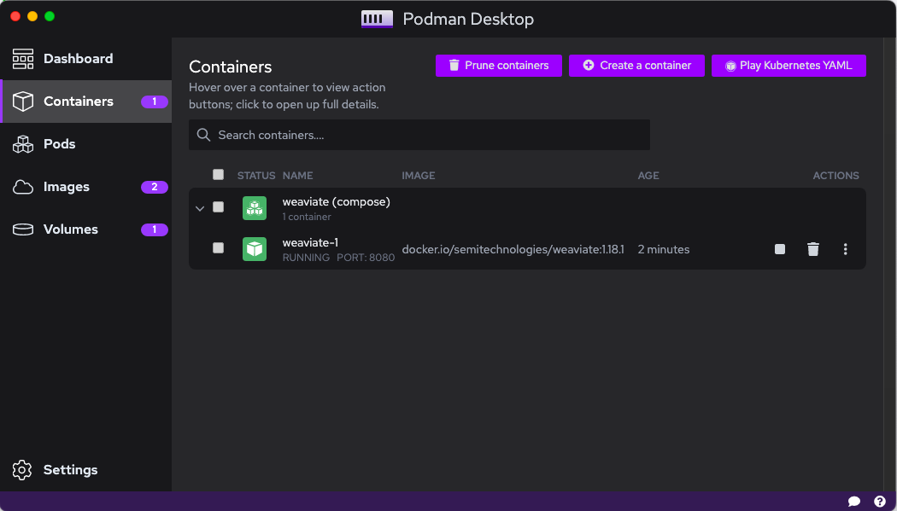
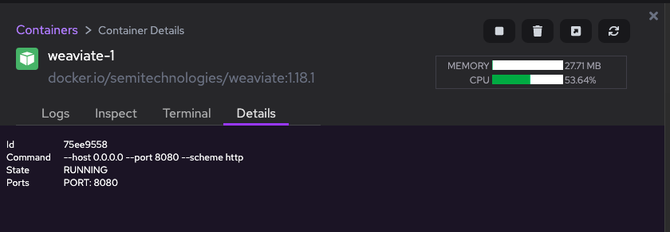
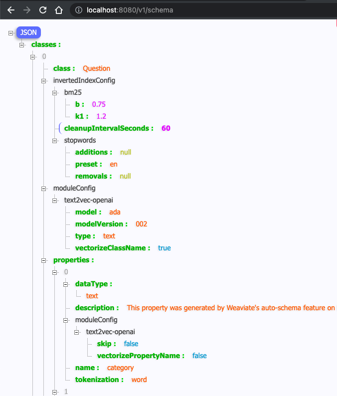
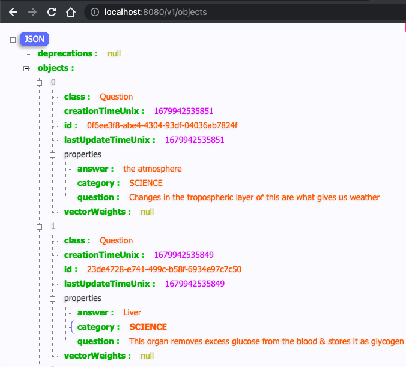
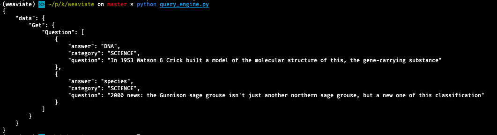
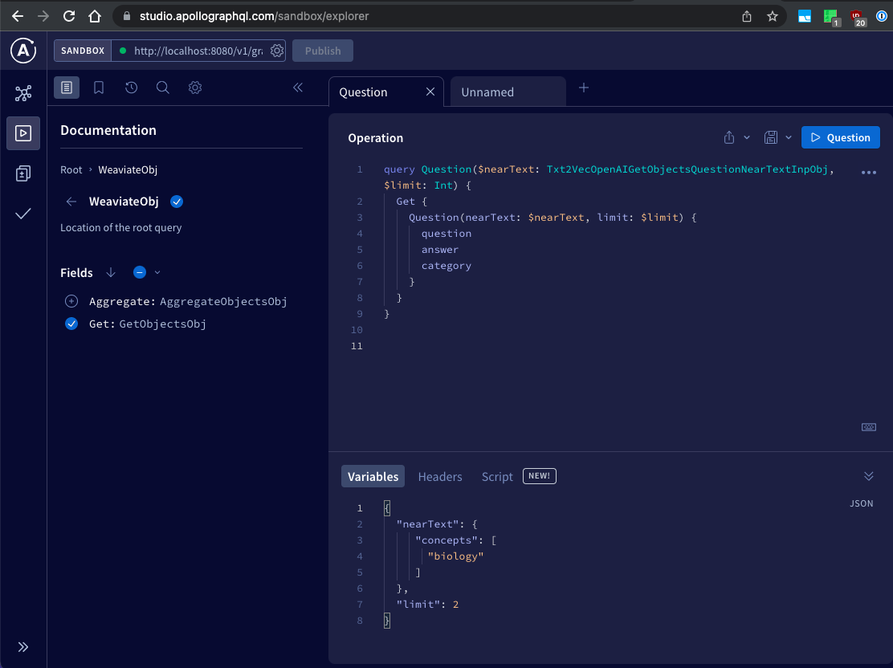

# OpenAI experiments with Weaviate - Turnkey Edition

#### Motivation

I just needed a simple `AI` container where I could fire up a vector database, connect to OpenAI and (re)create schemas and objects without caring much about anything else. And I wanted it to support languages like Python, JavaScript etc.

Basically: *Clone it, install packages, and have fun with it.* :)

### Requirements

* [Python 3](https://www.python.org/)
* [PipEnv](https://pypi.org/project/pipenv/) or similar tools
* [Podman Desktop](https://podman-desktop.io/) or [Docker Desktop](https://www.docker.com/products/docker-desktop/)

### Setup

* Install [python 3](https://www.python.org/downloads/) for your OS
* Install [pipenv](https://pipenv.pypa.io/en/latest/) with `pip install --user pipenv`
* Initialize pipenv in cloned repo with `pipenv --python3`
* Start python env with `pipenv shell`
* Install python packages `weaviate-client`, `requests`, and `json` with `pip3 install PKG_NAME`
* Generate an [OpenAI API Key](https://platform.openai.com/account/api-keys)
* Add this key to local shell. By default the variable must be called `OPENAI_APIKEY`
* Optionally, reconfigure `docker-compose.yml` to use additional plugins from [Weaviate](https://weaviate.io/developers/weaviate/installation/docker-compose)
* Start container with `podman-compose up -**d**` or `docker-compose up -d`

This is how the running container should look like.





### Using Weaviate with OpenAI

* Open http://localhost:8080/v1/schema (it should be empty on the first start)
* Go to shell and execute `python setup_engine.py`
* Refresh the page

You should see something like this:



Also check objects unter http://localhost:8080/v1/objects



Now query for some of those objects by using executing `python query_engine.py`. You should get these results back:



As Weaviate also supports GraphQL you could use [Apollo GraphQL Explorer](https://studio.apollographql.com/sandbox/explorer) to send queries.

Just enter http://localhost:8080/v1/graphql into the sandbox field.



### Docker Compose

The default docker-compose.yml from this repo looks like this.

```yaml
---
version: '3.4'
services:
  weaviate:
    command:
    - --host
    - 0.0.0.0
    - --port
    - '8080'
    - --scheme
    - http
    image: semitechnologies/weaviate:1.18.1
    ports:
    - 8080:8080
    restart: on-failure:0
    volumes:
    - weaviate_local:/var/lib/weaviate   # mapping volume to keep schema, otherwise it'd be deleted after restart 
    environment:
      OPENAI_APIKEY: $OPENAI_APIKEY        # OpenAI API key must be present as shell variable: `echo $OPENAI_APIKEY`
      QUERY_DEFAULTS_LIMIT: 25
      AUTHENTICATION_ANONYMOUS_ACCESS_ENABLED: 'true'
      PERSISTENCE_DATA_PATH: '/var/lib/weaviate'
      DEFAULT_VECTORIZER_MODULE: 'text2vec-openai'
      ENABLE_MODULES: 'text2vec-openai'
      CLUSTER_HOSTNAME: 'node1'
...
```

### License

[MIT](LICENSE)